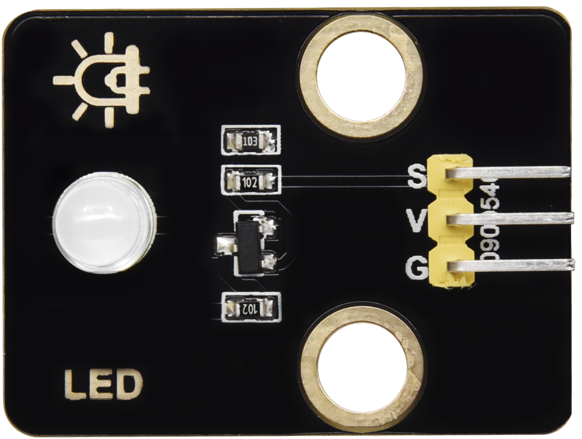
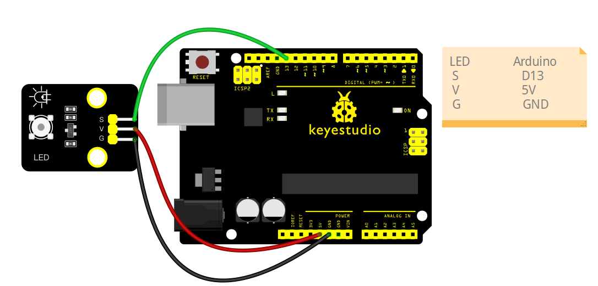

# keyestudio LED Module Tutorial(Single-color)



## 1. Introduction

This tutorial explains how to use an **keyestudio LED module**, including module description, wiring instructions, parameters, and sample code. After completing this guide, you will be able to control LED lighting effects such as **ON/OFF, blinking, and brightness adjustment**.

## 2.Specifications

| Parameter         | Description                           |
| ----------------- | ------------------------------------- |
| Operating Voltage | DC 5V                                 |
| Operating Current | ~20mA per LED                         |
| Control Method    | Arduino digital pin or PWM            |
| PWM Range         | 0–255 (0 = off, 255 = max brightness) |
| Dimensions        | Length：31.5 mm     Width：23.5 mm    |

## 3.Required Materials

- Arduino Uno （Compatible with ESP32, STM32, Raspberry Pi, and others）
- LED Module
- Jumper wires

## 4.Wiring Instructions（Arduino UNO R3)

| LED Pin | Arduino Pin                     |
| ------- | ------------------------------- |
| VCC     | 5V                              |
| GND     | GND                             |
| S       | D13 (or any digital output pin) |



## 5.Sample Code

### 5.1 Blink a Single LED

```c
int led = 13; // LED signal pin

void setup() {
  pinMode(led, OUTPUT);
}

void loop() {
  digitalWrite(led, HIGH); // Turn on
  delay(500);
  digitalWrite(led, LOW);  // Turn off
  delay(500);
}
```

**Experimental phenomena：**

After uploading the code using the Arduino IDE, you will observe the LED module connected to pin D13 flashing.

### 5.2 PWM Fading Example 

```c
int led = 9; // PWM-capable pin

void setup() {
  pinMode(led, OUTPUT);
}

void loop() {
  // Fade in
  for (int i = 0; i <= 255; i++) {
    analogWrite(led, i);
    delay(10);
  }
  // Fade out
  for (int i = 255; i >= 0; i--) {
    analogWrite(led, i);
    delay(10);
  }
}
```

**Experimental phenomena：**

Connect the S pin of the LED module to the D9 pin. After uploading the code using the Arduino IDE, you will observe the LED module connected to the D9 pin gradually brightening and dimming.
